# **Задачі**

## **Задача 1. Базові SELECT**

1. Вивести всіх студентів, які зареєструвалися після 2024‑01‑01.

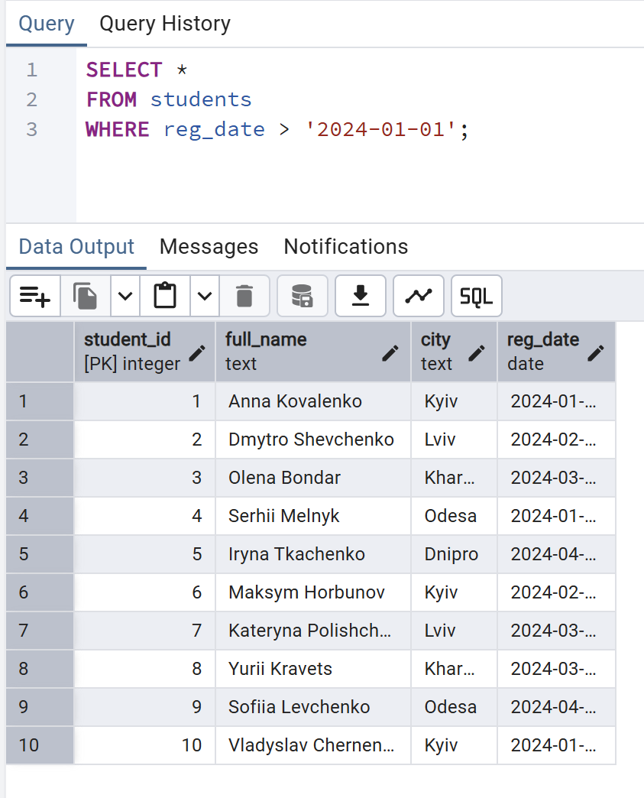

2. Вивести всі курси категорії `"Data Science"`.

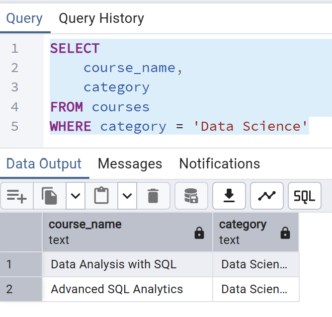

## **Задача 2. Групування та агрегація**

1. Порахувати кількість студентів у кожному місті.

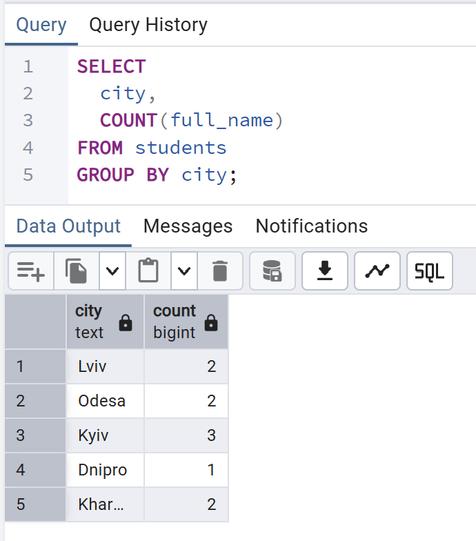

2. Порахувати кількість курсів у кожній категорії.

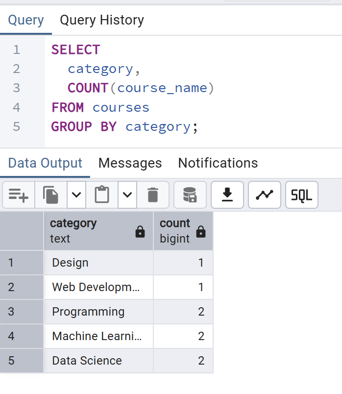

3. Порахувати середню оцінку по кожному курсу.

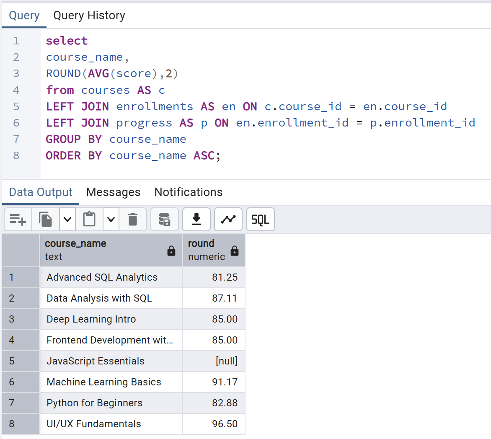

## **Задача 3. JOIN‑аналіз**

1. Вивести список курсів разом з іменами викладачів.

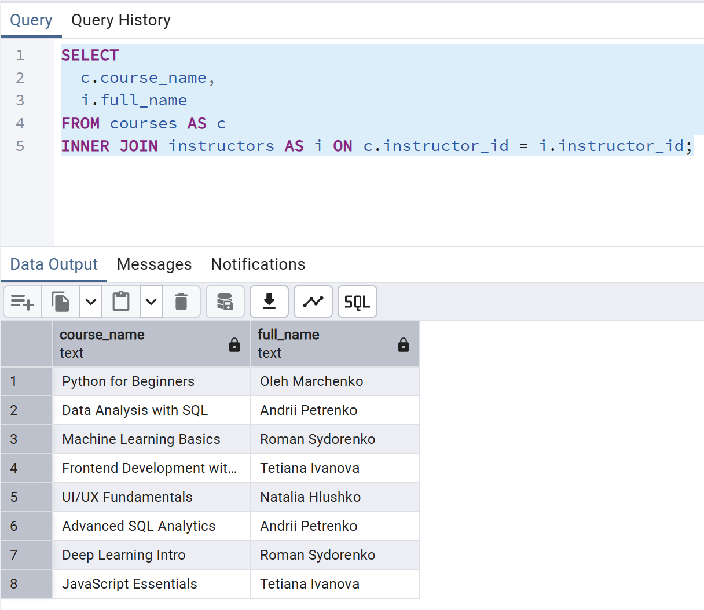

2. Вивести студентів та назви курсів, на які вони записані.

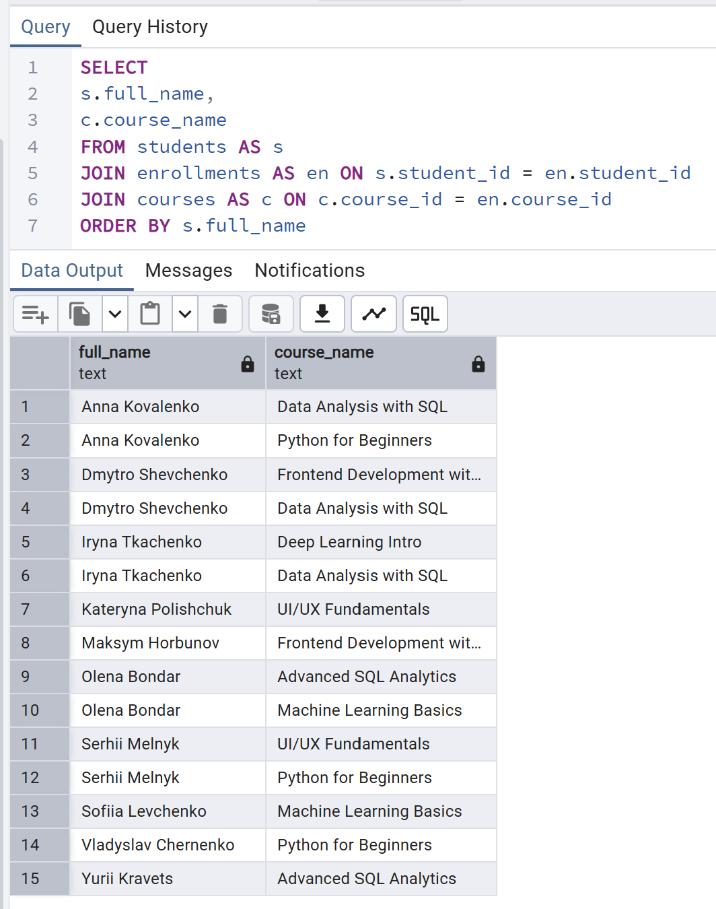

3. Порахувати, скільки студентів у кожного викладача.

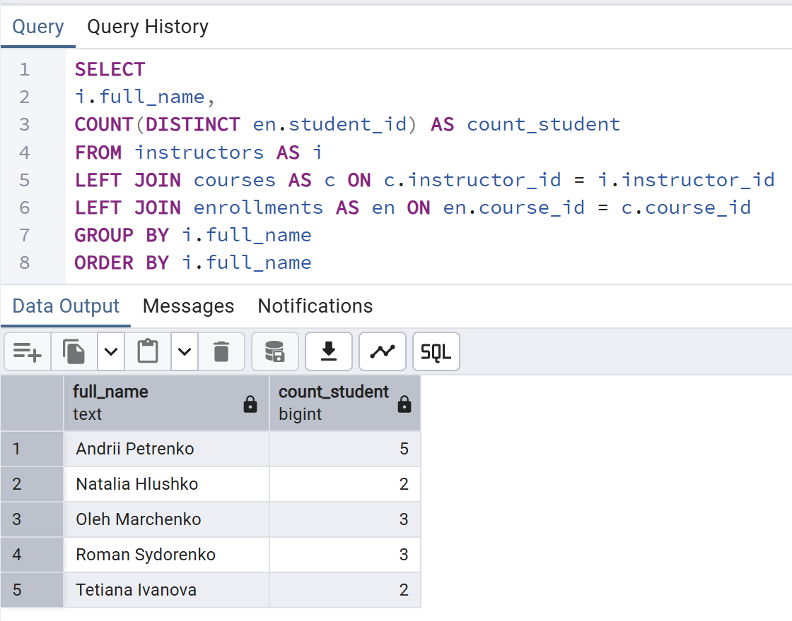

## **Задача 4. Аналітика прогресу**

1. Порахувати середню оцінку кожного студента.

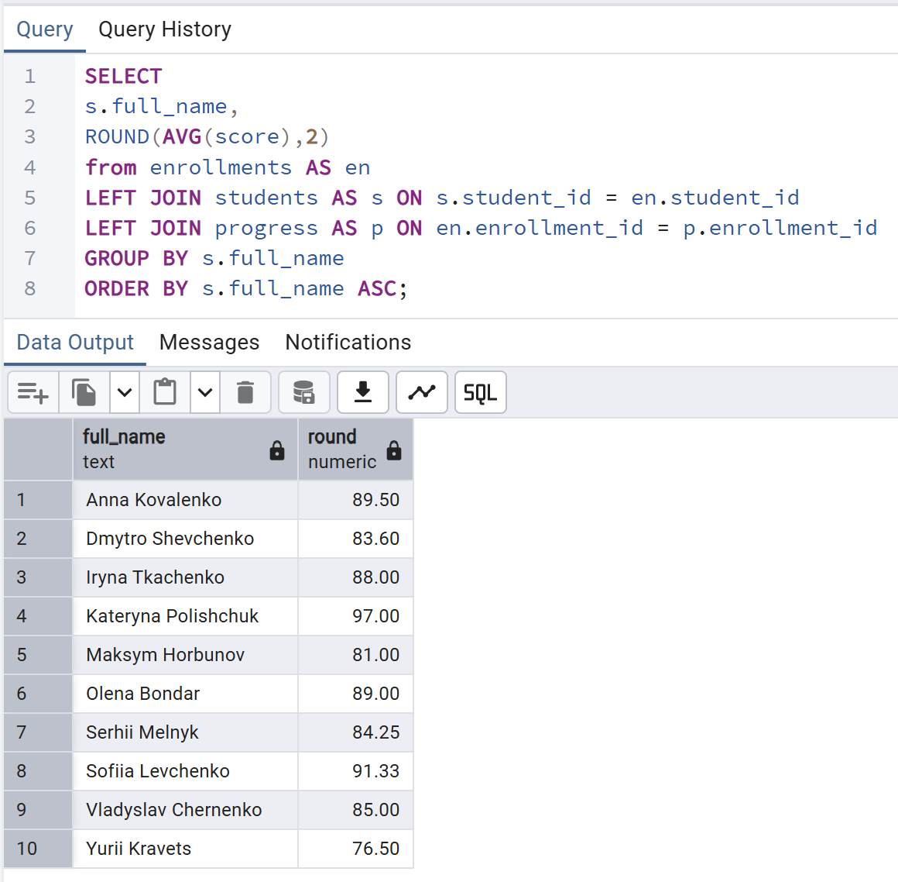

2. Порахувати відсоток завершених уроків для кожного курсу.

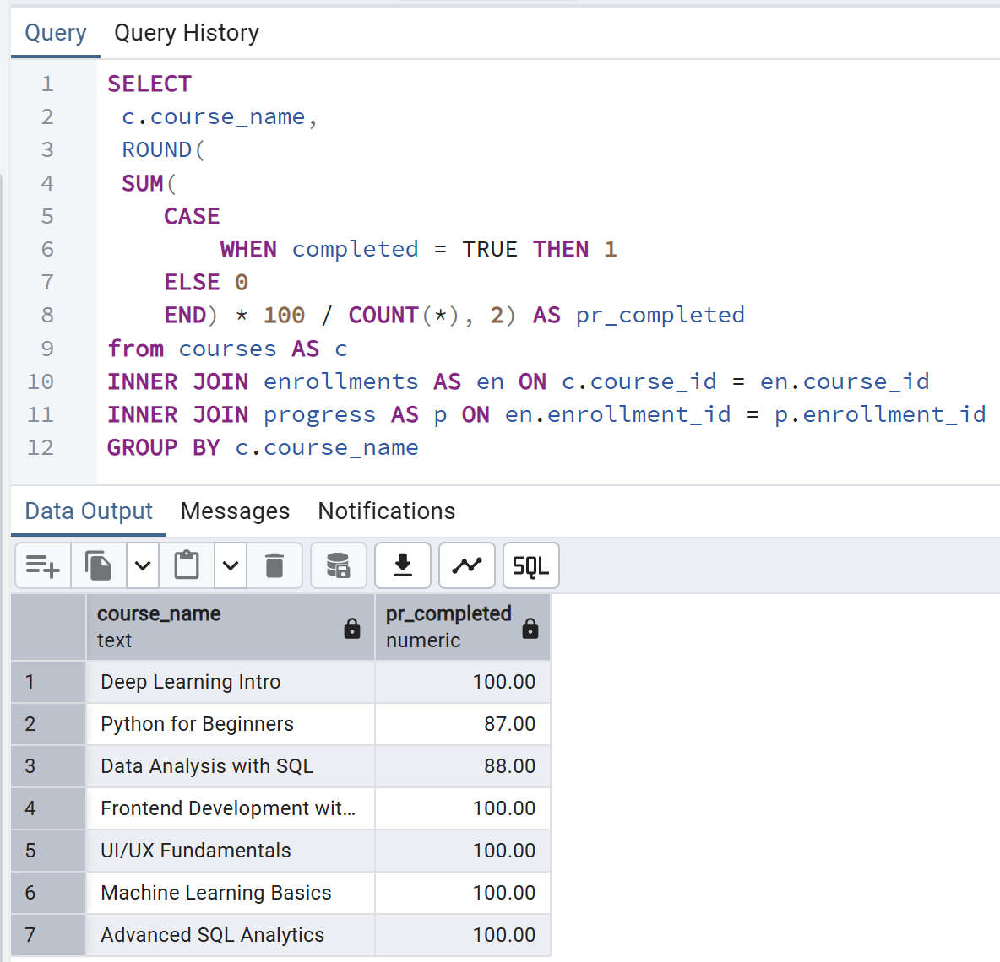

3. Знайти студентів, які завершили всі уроки у своїх курсах.

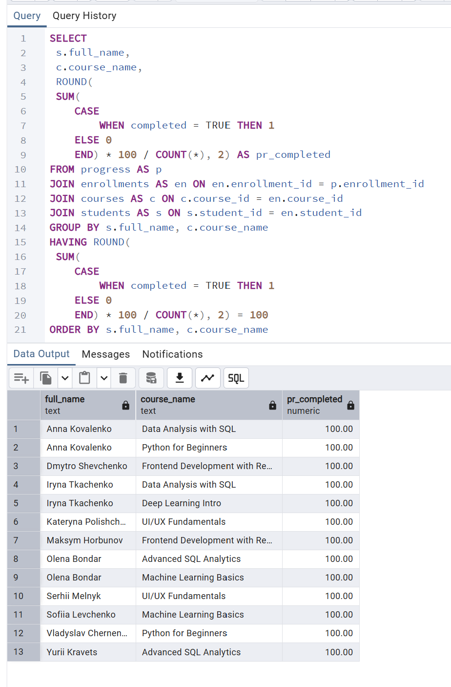

## **Задача 5. Віконні функції**

1. Для кожного курсу визначити рейтинг студентів за середнім балом.

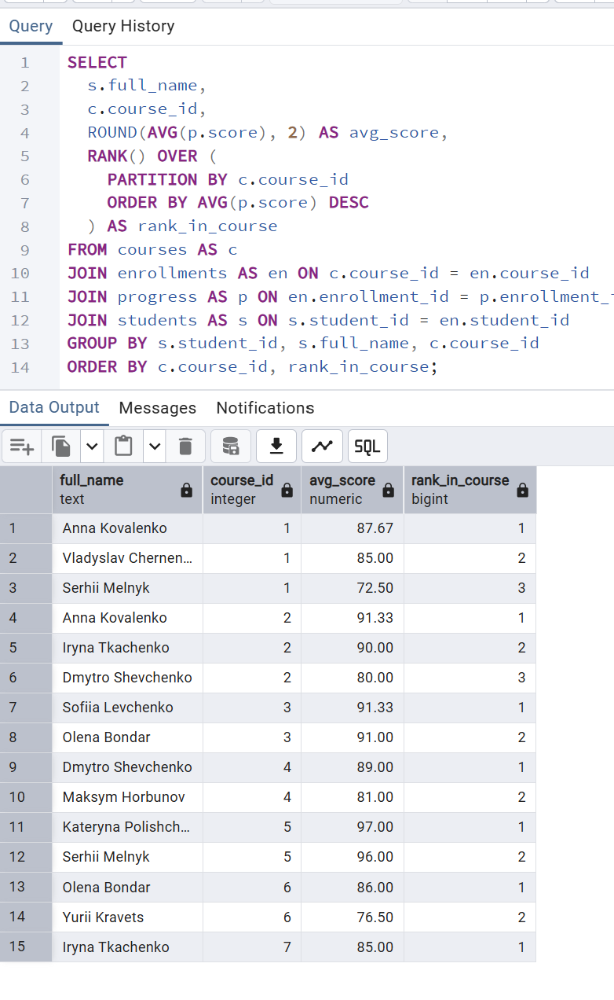

2. Порахувати кумулятивну кількість уроків, завершених студентом у хронологічному порядку.

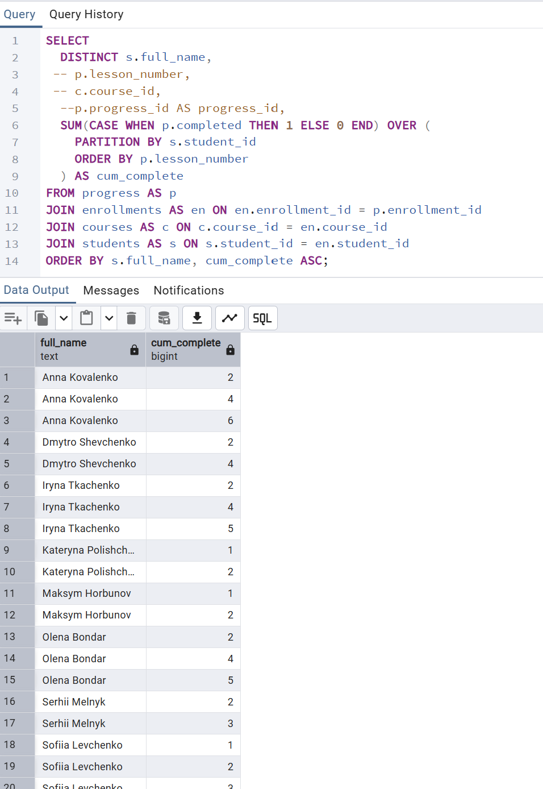

3. Для кожної категорії курсів знайти топ‑1 курс за кількістю студентів.

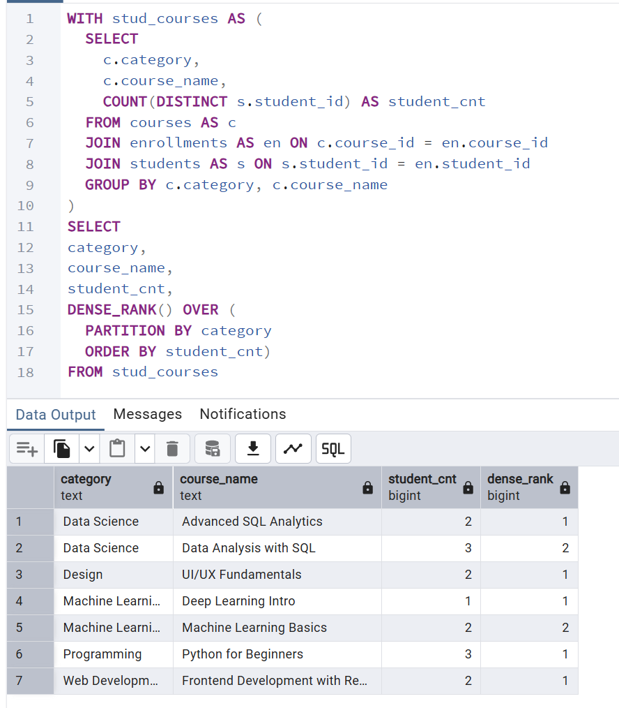

# **Звіт**

Відповідно до проведеного аналізу датасету онлайн-освітньої платформи були отримані такі результати.

Середня оцінка кожного студента знаходиться в діапазоні від **76,5 до 89,5 балів**, що свідчить про загалом високий рівень успішності.

Відсоток завершених курсів також є достатньо високим і становить **від 87% до 100%**.

Причини незавершення курсів **Python** та **Data Analysis with SQL** встановити неможливо, оскільки в датасеті відсутня інформація про дату початку та плановий строк завершення курсів. Через це неможливо визначити, чи перебувають ці курси в процесі завершення, чи були покинуті студентами.

Також було визначено кількість студентів, які повністю завершили курси. Водночас аналіз кількості студентів, що не завершили курс або знаходяться в процесі навчання, не входив до поставлених задач аналізу датасету.

Окрім цього, було розраховано рейтинги студентів для кожного курсу на основі їхнього середнього балу.

Було проведено розрахунок кумулятивної кількості уроків, завершених студентами у хронологічному порядку. Лідерами за цим показником є **Коваленко Анна**, **Ірина Ткаченко** та **Олена Бондар**.

Також для кожної категорії курсів було визначено **топ-1 курс за кількістю студентів**:

- **Data Science** — *Advanced SQL*
- **UI/UX** — *UI/UX Fundamentals*
- **Analytics** — *Deep Learning Intro*
- **Programming** — *Python for Beginners*
- **Frontend** — *Frontend Development with React*
